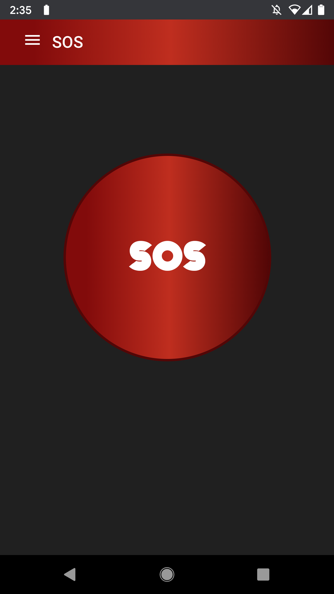
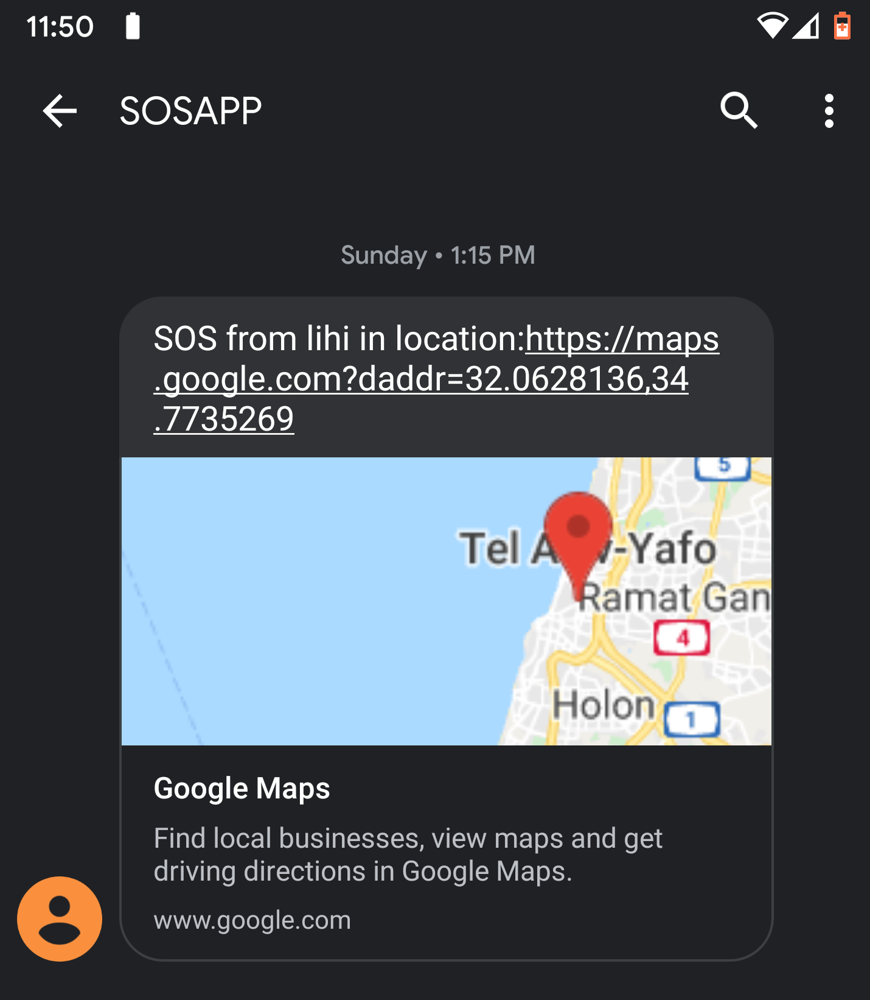
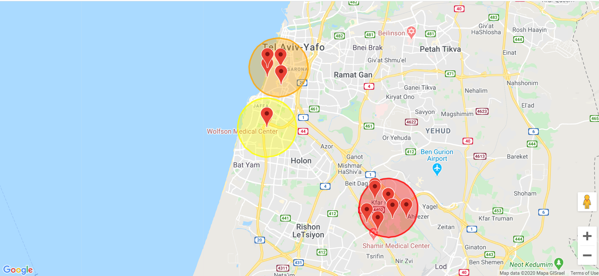
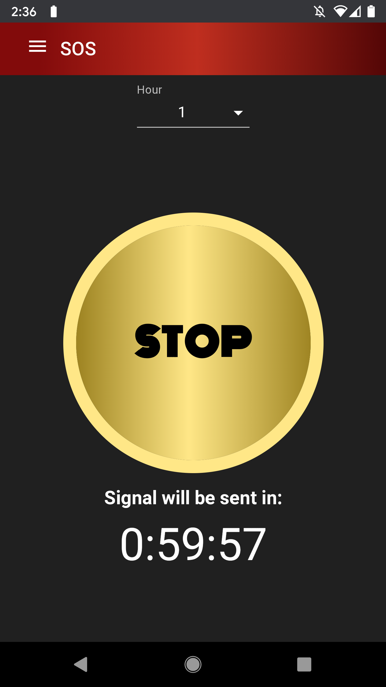
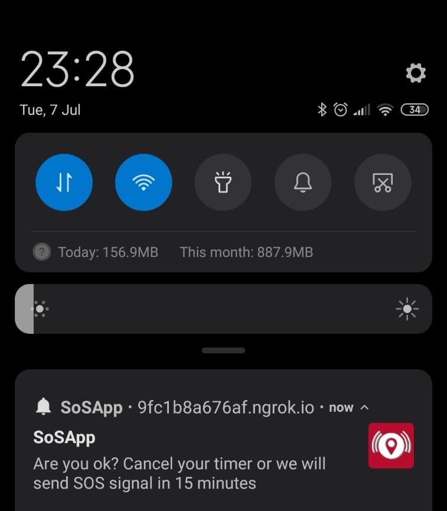

# SOS
A PWA (mobile app) that allows users in danger to request emergency assistance with the click of a button from an entire group of emergency contacts. It also helps users avoid danger areas using a live SOS map.

## Screenshots and Features

### SOS Button
The app uses user’s preconfigured emergency contacts by simultaneously notifying all of them via SMS or by sending push notifications, as configured, and calling a preselected one.

### SMS Message
Contacts receive a link that lets them see the user’s location on a map.

### Danger Map
Users can see all other recent SOS calls on a live map which updates in real-time, with those from the last hour easily noticeable by a bouncy effect. The map also shows different zones as colored circles, where the color corresponds to the number of SOS calls in that zone. This allows users to avoid danger areas for example.

### Timer
Users can also schedule an SOS call ahead of time, in case they walk into a potentially dangerous situation and may not be able to initiate the SOS when they need it. 

### Push Notifications
The app gives users the chance to cancel the scheduled SOS shortly before it is initiated to avoid unintentionally sending a false alarm.

